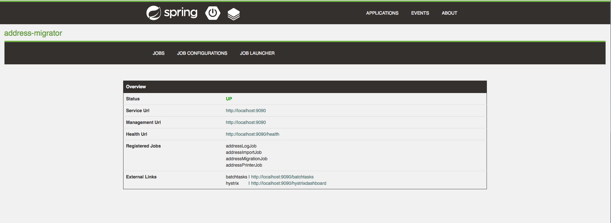
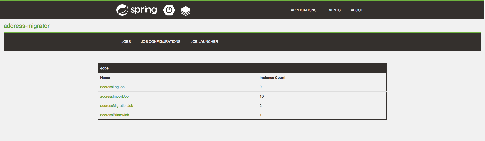
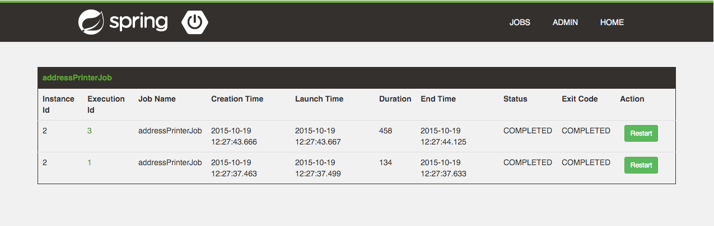
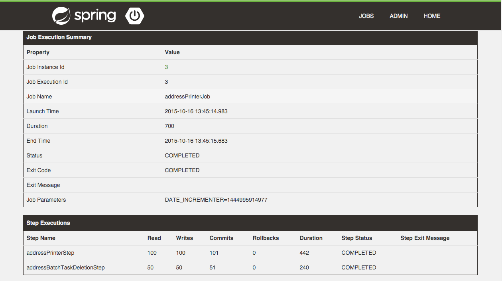
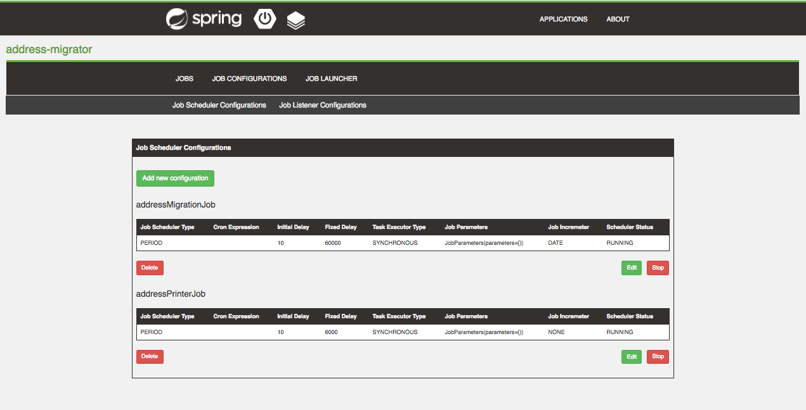
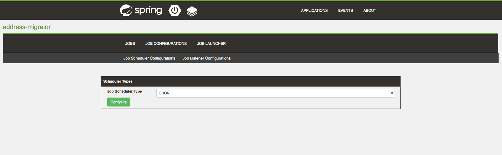
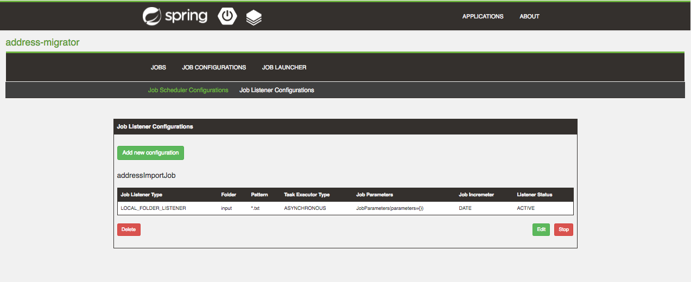
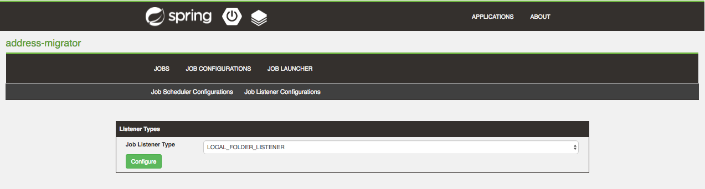
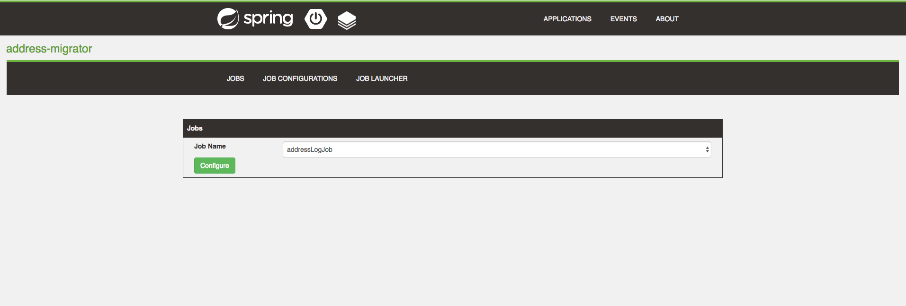
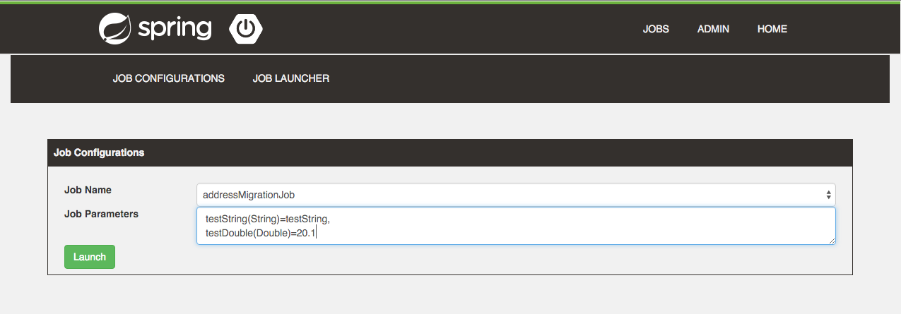

= Spring Batch Lightmin
:toc:
:asciidoctor-source: ./spring-batch-lightmin-documentation/src/main/asciidoc

The _Spring Batch Lightmin_ is a client-server library on top of the _Spring Batch_ and _Spring Boot_ to monitor and configure _Spring Batch Jobs_.
By enabling the _Spring Batch Lightmin_, a _BatchConfigurer_ will be registered and provides

* JobRepository
* JobOperator
* JobExplorer
* JobLauncher
* JobBuilderFactory
* StepBuilderFactory

and depending beans out of the box.

== Documentation

The documentation can be found at https://github.com/tuxdevelop/spring-batch-lightmin/tree/master/spring-batch-lightmin-documentation/src/main/doc/spring_batch_lightmin.html[Spring Batch Linghtmin Documentation]

== Samples

Samples of the _Spring Batch Lightmin_ are available at https://github.com/tuxdevelop/spring-batch-lightmin-samples[Sample Applications]

== Overview

image::overview.png[]

== Getting Started

=== Server

==== Maven Dependencies

[source,xml]
----
<dependency>
    <groupId>org.tuxdevelop</groupId>
    <artifactId>spring-batch-lightmin-server</artifactId>
    <version>{spring-batch-lightmin.version}</version>
</dependency>
----

==== Enable the Server

[source,java]
----
@SpringBootApplication
@EnableSpringBatchLightminServer
public class LightminServer {

    public static void main(final String[] args) {
        SpringApplication.run(LightminServer.class, args);
    }
}
----

The code above enables the _SpringBatchLightminServer_ with default properties.

===== Property Configuration

[source, yaml]
----
server:
  port: 8090
----

==== Server service discovery

In order to detected lightmin client via service discovery, the following property has to be set to true

[source, yaml]
-----
spring:
  batch:
    lightmin:
      server:
        discovery-enabled: true
-----

The server itself has to be a _DiscoveryClient_.

===== Server behind a Proxy

The server ui uses redirects and the _HOST_ header is taken to create the redirect urls. This is the default behavior of Spring MVC.
If the server ui is running behind a proxy, the implementation of the server takes care, that the _X-FORWARD-PREFIX_ header is used as well.

If the proxy cannot pass the _HOST_ header or you do not want to change the default, e.g. _Zuul_, the following property can force the server
to use the _X-FORWARDED-HOST_ header to build the redirect urls.

[source, yaml]
----
spring:
  batch:
    lightmin:
      server:
        use-x-forwarded-headers: true
----

=== Client

==== Maven Dependencies

[source,xml]
----
<dependency>
    <groupId>org.tuxdevelop</groupId>
    <artifactId>spring-batch-lightmin-client</artifactId>
    <version>{spring-batch-lightmin.version}</version>
</dependency>
----

==== Enable the Client

[source, java]
----
@SpringBootApplication
@EnableSpringBatchLightminClient
public class LightminClient {

    public static void main(final String[] args) {
        SpringApplication.run(LightminClient.class, args);
    }

}
----

The code above enables the _SpringBatchLightminClient_ with the default configuration.
The default configuration provides a _JdbcJobRepository_, _JdbcJobConfigurationRepository_ and
needs a configured _DataSource_ with the bean name _dataSource_.

In order to register to the _SpringBatchLightminServer_, the property
_spring.batch.lightmin.server.url_ has to be set.

===== Property Configuration

[source, yaml]
----
spring:
  batch:
    lightmin:
      server:
        url: http://localhost:8090
----

==== Service Discovery

The client library also provides support for service discovery with _Consul_ and _Eureka_.

In order to use service discovery, one of the spring cloud starter has to be on the classpath

The dependency below shows the consul integration

[source, xml]
----
<dependency>
    <groupId>org.springframework.cloud</groupId>
    <artifactId>spring-cloud-starter-consul-discovery</artifactId>
</dependency>
----

In order to use the discovery feature of s_Spring Cloud_ one configuration class has to have the _@EnableDiscoveryClient_ annotation.

[source, java]
----
@EnableScheduling
@EnableDiscoveryClient
@EnableSpringBatchLightminClient
public class AddressMigratorApp {

    public static void main(final String[] args) {
        SpringApplication.run(AddressMigratorApp.class, args);
    }

}
----

===== Auto registration server side

The client has to set the following property to activate the client side adaption for the server side auto registration.

[source, yaml]
----
spring:
  batch:
    lightmin:
      client:
        # default value: false
        discovery-enabled: true
----

If the property is set to _true_. the discovery client configuration will be enriched by meta tags, which let the server detected the _Spring Batch Lightmin_ clients.

If the server should be also found via service discovery, e.g. for push notifications, the next section will give all the details for the configuration.

===== Client side server discovery

In order to find the server via service discovery, the following properties has to be set.

[source, yaml]
----
spring:
  batch:
    lightmin:
      client:
        # default value: false
        discover-server: true
        # default value: lightmin-server
        server-discovery-name: lightmin-server
----

This will enable the following behavior

* The lightmin client will use service discovery for push notification to the server.
* The lightmin client will use service discovery to register at the server, if the following property is set to *false* or not present.

[source, yaml]
----
spring:
  batch:
    lightmin:
      client:
        discovery-enabled: false
----

===== Service Discovery for Remote Repository Server

If the client has configured service discovery, the following properties will activate client side auto detection for the _Remote Repository Server_.
The _Remote Repository Server_ itself has to be a _DiscoveryClient_ as well.

[source ,yaml]
----
spring:
  batch:
    lightmin:
      application-name: my-application-name
      lightmin-repository-type: remote
      # default value: false
      discover-remote-repository: true
      # default value: spring-batch-lightmin-repository-server
      remote-repository-server-discovery-name: spring-batch-lightmin-repository-server

----

=== Embedded Server

If you want to use the _SpringBatchLightmin_ in a single application context, an
embedded server mode is provided.

==== Maven Dependencies

[source,xml]
----
<dependency>
    <groupId>org.tuxdevelop</groupId>
    <artifactId>spring-batch-lightmin-server</artifactId>
    <version>{spring-batch-lightmin.version}</version>
</dependency>
----

==== Enable the Server

[source,java]
----
@SpringBootApplication
@EnableEmbeddedSpringBatchLightminServer
public class LightminEmbeddedServer {

    public static void main(final String[] args) {
        SpringApplication.run(LightminEmbeddedServer.class, args);
    }
}
----

The code above will boostrap the _SpringBatchLightminClient_ and the
_SpringBatchLightminServer_ in an embedded mode.

=== Remote Repository Server

The third repository type is the _remote repository_. The _Job Configurations_ are located on an external service.

==== Maven

[source,xml]
----
<dependency>
    <groupId>org.tuxdevelop</groupId>
    <artifactId>spring-batch-lightmin-repository-server</artifactId>
    <version>{spring-batch-lightmin.version}</version>
</dependency>
----

==== Enable the Remote Repository Server

[source, java]
----
@SpringBootApplication
@EnableSpringBatchLightminRemoteRepositoryServer
public class LightminRepositoryServer {

    public static void main(final String[] args) {
        SpringApplication.run(LightminRepositoryServer.class, args);
    }
}
----

=== Getting the lastest SNAPSHOTS

In order to get the latest _SNAPSHOTS_, you have to activate the sonatype snapshot repository.

[source,xml]
----
<repositories>
    <repository>
        <id>ossrh</id>
        <url>https://oss.sonatype.org/content/repositories/snapshots</url>
    </repository>
</repositories>
----

== Spring Batch Lightmin UI

=== Applications

The start page of the _SpringBatchLightmin_ shows all register applications. The status value shows the current health status of the application.

image::index.png[]

=== Application Information

The application information view is the entry point to the monitoring and administration of a client application. The overview shows the important endpoints, all known _Spring Batch Jobs_ and configured external links of the client application.
The Menu gives the access to monitoring (Job), administration (Job Configurations) and job launcher sections.

=== Jobs

All known jobs  of the client application will be listed in the jobs tab with their current instance count.
To get more detailed informations about the job instances, you have to click on the job name, you want to view.

==== Job Instances

After selecting a job by name, all instances of the job will be listed with their current execution count. In order
to get more detailed information about the executions of the instance, select the desired job instance id.

image::job_instances.png[]

==== Job Executions

The view will show an overview of all executions for the selected instance id. To get details of the job execution,
click on the desired id.

==== Job Execution

The job execution view shows you a detailed overview about the job and step executions of the selected job execution.

=== Job Configurations

The job configurations view gives an overview about all stored job configurations. At this point, you can add and delete
 new job configurations, start and stop and edit existing configurations.

==== Job Scheduler

_Job Scheduler Configurations_ are cron or time based scheduler.

===== Add Job Scheduler Configuration

====== Job Scheduler Type

* CRON
* PERIOD

image::scheduler_add.png[]

====== Job Name

Registered _Spring Batch Jobs_.

====== CRON Expression

CRON expression, if the _Job Scheduler Type_ is _CRON_

====== Fixed Delay

Restart delay, if the _Job Scheduler Type_ is _PERIOD_

====== Initial Delay

Initial delay of the first job launch, if the _Job Scheduler Type_ is _PERIOD_

====== Task Executor Type

* SYNCHRONOUS
* ASYNCHRONOUS

====== Scheduler Status

* INITIALIZED
* RUNNING
* STOPPED

====== Job Parameters

Configurable parameters, which will be passed to the _JobLauncher_ on each start.

The format of the parameters has to

----
name(type)=value, name2(type)=value2
----

Possible types are

* String
* Long
* Double
* Date

====== Job Incrementer Type

Additional job parameter, to give each job instance uniqueness.

* NONE
* DATE

==== Job Listener

_Job Listener Configurations_ bases on event, e.g. the viewed folder gets a new file.

===== Add Job Listener configuration

====== Job Scheduler Type

* LOCALE FOLDER LISTENER

If the _LOCAL FOLDER LISTENER_ event is fired, the absolute path to the file will be passed as _Job Parameter_ with
the name *_fileSource_* to the _Job Launcher_.

image::listener_add.png[]

====== Job Name

Registered _Spring Batch Jobs_.

====== Source Folder

The path to the listened folder

====== File Pattern

Ant based file pattern, e.g. *.txt

====== Poller Period

The time in millis between the the current and the next folder scan.

====== Task Executor Type

* SYNCHRONOUS
* ASYNCHRONOUS

====== Listener Status

* ACTIVE
* STOPPED

====== Job Parameters

Configurable parameters, which will be passed to the _JobLauncher_ on each start.

The format of the parameters has to

----
name(type)=value, name2(type)=value2
----

Possible types are

* String
* Long
* Double
* Date

====== Job Incrementer Type

Additional job parameter, to give each job instance uniqueness.

* NONE
* DATE

==== Job Launcher

===== Job Name

Name of the _Spring Batch Job_

===== Job Launcher Configuration

====== Job Parameters

Configurable parameters, which will be passed to the _JobLauncher_ on start. If an execution of the selected has
already been launched, the _JobParameters_ of the last run will be shown.

The format of the parameters has to

----
name(type)=value, name2(type)=value2
----

Possible types are

* String
* Long
* Double
* Date

====== Job Incrementer

Additional job parameter, to give each job instance uniqueness.

* NONE
* DATE

=== Events

The Events view shows all current finished executions of all clients.

image::event.png[]