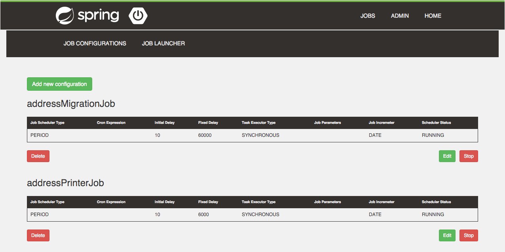
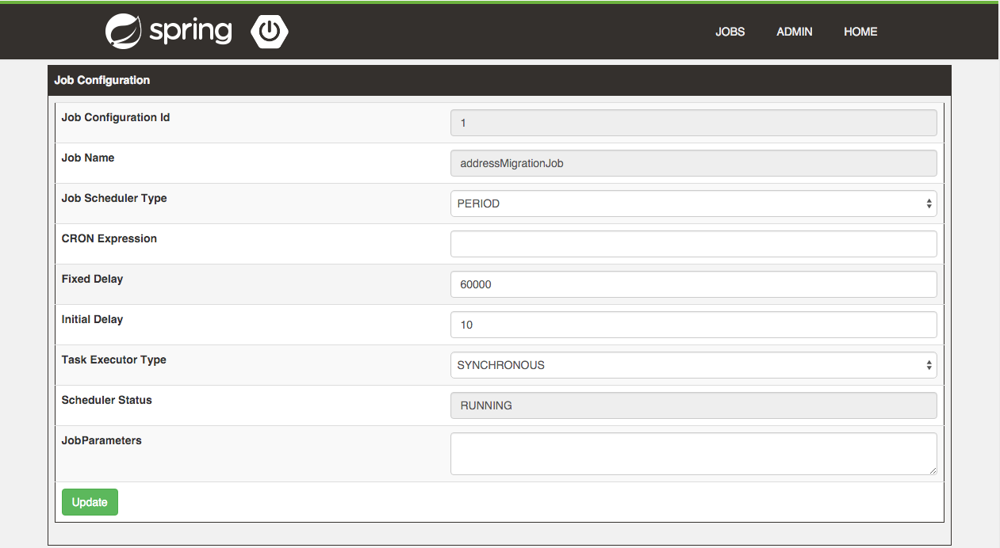

= Spring Batch Lightmin
:toc:
:asciidoctor-source: ./spring-batch-lightmin-documentation/src/main/asciidoc

The _Spring Batch Lightmin_ is a client-server library on top of the _Spring Batch_ and _Spring Boot_ to monitor and configure _Spring Batch Jobs_.
By enabling the _Spring Batch Lightmin_, a _BatchConfigurer_ will be registered and provides

* JobRepository
* JobOperator
* JobExplorer
* JobLauncher
* JobBuilderFactory
* StepBuilderFactory

and depending beans out of the box.

=== Overview

image::overview.svg[]

The documentation can be found at http://htmlpreview.github.io/?https://github.com/tuxdevelop/spring-batch-lightmin/blob/next/spring-batch-lightmin-documentation/src/main/doc/spring_batch_lightmin.html[Spring Batch Linghtmin Documentation]

== Getting Started

=== Server

==== Maven Dependencies

[source,xml]
----
<dependency>
    <groupId>org.tuxdevelop</groupId>
    <artifactId>spring-batch-lightmin-server</artifactId>
    <version>{spring-batch-lightmin.version}</version>
</dependency>
----

==== Enable the Server

[source,java]
----
@SpringBootApplication
@EnableSpringBatchLightminServer
public class LightminServer {

    public static void main(final String[] args) {
        SpringApplication.run(LightminServer.class, args);
    }
}
----

The code above enables the _SpringBatchLightminServer_ with default properties.

===== application.properties

[source, java]
----
server.port=8090
----

=== Client

==== Maven Dependencies

[source,xml]
----
<dependency>
    <groupId>org.tuxdevelop</groupId>
    <artifactId>spring-batch-lightmin-client</artifactId>
    <version>{spring-batch-lightmin.version}</version>
</dependency>
----

==== Enable the Client

[source, java]
----
@SpringBootApplication
@EnableSpringBatchLightminClient
public class LightminClient {

    public static void main(final String[] args) {
        SpringApplication.run(LightminClient.class, args);
    }

}
----

The code above enables the _SpringBatchLightminClient_ with the default configuration.
The default configuration provides a _JdbcJobRepository_, _JdbcConfigurationRepostor_ and
needs a configured _DataSource_ with the bean name _dataSource_.

In order to register to the _SpringBatchLightminServer_, the property
_spring.batch.lightmin.server.url_ has to be set.

===== application.properties

[source, java]
----
spring.batch.lightmin.server.url=http://localhost:8090
----

=== Embedded Server

If you want to use the _SpringBatchLightmin_ in a single application contex, an
embedded server mode is provided.

==== Maven Dependencies

[source,xml]
----
<dependency>
    <groupId>org.tuxdevelop</groupId>
    <artifactId>spring-batch-lightmin-server</artifactId>
    <version>{spring-batch-lightmin.version}</version>
</dependency>
----

==== Enable the Server

[source,java]
----
@SpringBootApplication
@EnableEmbeddedSpringBatchLightminServer
public class LightminEmbeddedServer {

    public static void main(final String[] args) {
        SpringApplication.run(LightminEmbeddedServer.class, args);
    }
}
----

The code above will boostrap the _SpringBatchLightminClient_ and the
_SpringBatchLightminServer_ in an embedded mode.

=== Getting the lastest SNAPSHOTS

In order to get the latest _SNAPSHOTS_, you have to activate the sonatype snapshot repository.

[source,xml]
----
<repositories>
    <repository>
        <id>ossrh</id>
        <url>https://oss.sonatype.org/content/repositories/snapshots</url>
    </repository>
</repositories>
----

== Spring Batch Lightmin UI

=== Index

The welcome page of the _Spring Batch Lightmin_ shows the hostname/ip-address and the servlet path of the current
instance. At this point, all available REST-endpoints and operations are also listed. In order to get deeper into the
_Lightmin_, you have to navigate through the top bar.

image::index.png[]

=== Jobs

On startup, the _Spring Batch Lightmin_ scans the _Spring Context_ to register all beans of the type _Job_ and make
them available into the _JobRegistry_. All known jobs will be listed in the jobs tab with their current instance count.
To get more detailed informations about the job instances, you have to click on the job name, you want to view.

image::jobs.png[]

==== Job Instances

After selecting a job by name, all instances of the job will be listed with their current execution count. In order
to get more detailed information about the executions of the instance, select the desired job instance id.

image::job_instances.png[]

==== Job Executions

The view will show an overview of all executions for the selected instance id. To get detailes of the job execution,
click on the desired id.

image::job_instance.png[]

==== Job Execution

The job execution view shows you a detailed overview about the job and step executions of the selected job execution.

image::job_execution.png[]

=== Admin

==== Job Configurations

The job configurations view gives an overview about all stored job configurations. At this point, you can add and delete
 new job configurations, start and stop the scheduler of the job configurations and edit existing configurations.

===== Add Job Configuration

image::job_configuration_add.png[]

====== Job Name

Registered _Spring Batch Jobs_.

====== Job Scheduler Type

* CRON
* PERIOD

====== CRON Expression

CRON expression, if the _Job Scheduler Type_ is _CRON_

====== Fixed Delay

Restart delay, if the _Job Scheduler Type_ is _PERIOD_

====== Initial Delay

Initial delay of the first job launch, if the _Job Scheduler Type_ is _PERIOD_

====== Task Executor Type

* SYNCHRONOUS
* ASYNCHRONOUS

====== Scheduler Status

* INITIALIZED
* RUNNING
* STOPPED

====== Job Parameters

Configurable parameters, which will be passed to the _JobLauncher_ on each start.

The format of the parameters has to

----
name(type)=value, name2(type)=value2
----

Possible types are

* String
* Long
* Double
* Date

====== Job Incrementer Type

Additional job parameter, to give each job instance uniqueness.

* NONE
* DATE

===== Edit Job Configuration

====== Job Configuration Id

Technical identifier of the configuration.

====== Job Name

Registered _Spring Batch Jobs_.

====== Job Scheduler Type

* CRON
* PERIOD

====== CRON Expression

CRON expression, if the _Job Scheduler Type_ is _CRON_

====== Fixed Delay

Restart delay, if the _Job Scheduler Type_ is _PERIOD_

====== Initial Delay

Initial delay of the first job launch, if the _Job Scheduler Type_ is _PERIOD_

====== Task Executor Type

* SYNCHRONOUS
* ASYNCHRONOUS

====== Scheduler Status

* INITIALIZED
* RUNNING
* STOPPED

====== Job Parameters

Configurable parameters, which will be passed to the _JobLauncher_ on each start.

The format of the parameters has to

----
name(type)=value, name2(type)=value2
----

Possible types are

* String
* Long
* Double
* Date

====== Job Incrementer Type

Additional job parameter, to give each job instance uniqueness.

* NONE
* DATE

==== Job Launcher

image::job_launcher.png[]

===== Job Name

Name of the _Spring Batch Job_

===== Job Launcher Configuration

image::job_launcher_configure.png[]

====== Job Parameters

Configurable parameters, which will be passed to the _JobLauncher_ on start. If an execution of the selected has
already beeb launched, the _JobParameters_ of the last run will be shown.

The format of the parameters has to

----
name(type)=value, name2(type)=value2
----

Possible types are

* String
* Long
* Double
* Date

====== Job Incrementer

Additional job parameter, to give each job instance uniqueness.

* NONE
* DATE